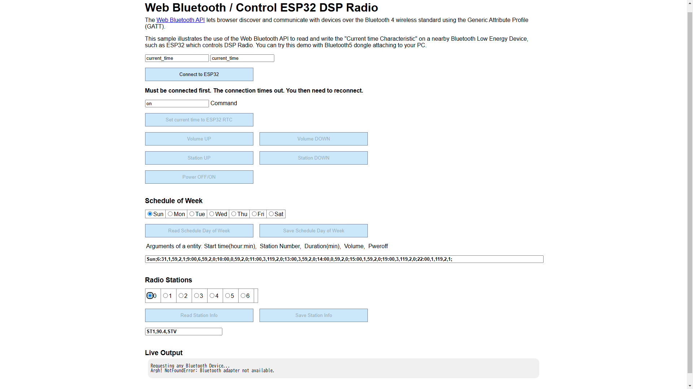
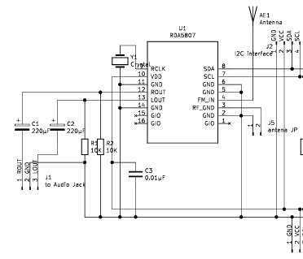

<H3>週間スケジュールが可能なRDA5807 FM DSPラジオ(Bluetooth LE版)</H3>

予めBluetooth通信により設定した週間スケジュールに基づいて番組を聴くことができるFMラジオを製作したので紹介する。 
利用したRDA5807FPは、RDAマイクロ製のFM対応のDSPラジオICである。<a href="https://www.aitendo.com/product/4797">安価（データシートの参照リンクあり）</a>に購入でき 
SOP16ピンのパッケージで、かつ使用部品が少なくて済むので使い易い。 
I2Cインターフェースでコントロールするが、ここでは、目標機能を実現するために、Bluetooth LE（BLE）機能（およびWiFi機能）を搭載した 
<a href="https://www.switch-science.com/products/8968">Seeed Studio XIAO ESP32S3</a>と組み合わせた。 
RDA5807FPは電圧3.3Vで動作し、必要な電流は20mA程度なので、XIAO ESP32S3（3V3端子）から供給できる（5Vは不可）。 
XIAO ESP32S3の制御にはBLE機能のプロファイルである「GATT」を利用している。その際、通信の手段として、ChromeなどのWebブラウザに実装された「Web bluetooth API」を使用する。 
開発はArduino IDE 2.1で行った。 

使用したRDA5807用のライブラリは、<a href="https://github.com/pu2clr/RDA5807">こちら（pu2clr at GitHub）</a>にある。<a href="https://pu2clr.github.io/RDA5807/#schematic">回路図等</a>も掲載されているので参考にすると良い。 
なお、Arduino IDEのライブラリ管理からもインストール可能である。 

BLEでは、セントラル（ここではPCのブラウザ）とペリフェラル（ESP32S3）間で通信を行う。ペリフェラル側では、GATTで定義された「データ構造」のサービスを構築し アドバタイズ（Advertise）状態で受信待ちする。
セントラル側からは、アドバタイズ状態のペリフェラルをスキャンして接続要求を行う。 
ここでは、便宜上、「データ構造」として、「GATT」の"Current time service"（UUIDで識別する）の定義を流用した。
サービスのキャラクタリスティックとディスクリプタはセントラル（指示）側からREAD/WRITEできるので、各々下記に示した目的で利用している。

&nbsp;&nbsp;&nbsp;&nbsp;サービス:&nbsp;Current time service&nbsp;― 
&nbsp;&nbsp;&nbsp;&nbsp;&nbsp;&nbsp;キャラクタリスティック1&nbsp;―&nbsp;XIAO ESP32S3の操作に利用 
&nbsp;&nbsp;&nbsp;&nbsp;&nbsp;&nbsp;&nbsp;&nbsp;ディスクリプタ1&nbsp;―&nbsp;書き込み時：時刻設定およびDSPラジオの操作、ブラウザに表示されているラジオボタンの曜日選択とラジオ局選択に利用 
&nbsp;&nbsp;&nbsp;&nbsp;&nbsp;&nbsp;キャラクタリスティック2&nbsp;―&nbsp;読み込み時：選択された曜日のスケジュールの情報を提供、書き込み時：選択されたラジオ局の情報および曜日のスケジュールの設定 
&nbsp;&nbsp;&nbsp;&nbsp;&nbsp;&nbsp;キャラクタリスティック3&nbsp;―&nbsp;読み込み時：ラジオ局の情報を提供 

<strong>機能</strong> 
 ・週間スケジュールを設定できる。曜日ごとに、番組の開始時間、番組の長さ、ラジオ局、音量、番組終了後ON/OFFを設定する。 
 ・時刻はWebブラウザ側からの操作で、XIAO ESP32S3に伝え、内部クロックに設定する。 
 ・週間スケジュールの設定は、PC、スマホ等のブラウザからXIAO ESP32S3にアクセスして行う。 
 ・同様に、ラジオ局の選局、音量の変更、ラジオのON/OFFは、ブラウザから行うことができる。 
 ・週間スケジュールの設定により、目覚まし機能、スリープ機能が可能である。 
 ・OLED表示装置に、日付、曜日、時刻、音量、ラジオのON/OFF、受信周波数を表示する。 
 ・XIAO ESP32S3の特定のピンにタクトスイッチを接続すれば、選局、音量調節、ラジオのON/OFFが可能である。 
 ・受信周波数の範囲は、76−108MHzで、ワイドFM対応である。 
 ・出力はオーディオジャック経由で小口径のスピーカー（ステレオ）を接続する。 

<strong>H/W構成</strong> 
 ・Seeed Studio XIAO ESP32S3 - コントローラ 
 ・I2C接続&nbsp; RDA5807FP 
 ・I2C接続&nbsp; SSD1306 64x32 OLED表示装置 
 ・Xtal発振器（32768Hz）、コンデンサ、抵抗類、オーディオジャック、配線類 

 
専用の基板（XIAO_ESP32C3の物を流用。<a href="https://www.pcbway.com/project/shareproject/RDA5807_FM_DSP_radio_with_weekly_schedule_which_is_controlled_by_XIAO_ESP32C3_dbd09236.html">基板のデータ</a>）に実装。右側がXIAO ESP32S3、左側がRDA5807FP。

<strong>接続</strong> 
各コンポーネントの接続は以下の通り。 

<table> 
<tr>
<td>I2C&nbsp;</td><td>XIAO(既定)</td>
</tr>
<tr>
<td>SCK</td><td>GPIO6</td>
</tr>
<tr>
<td>SDA</td><td>GPIO5</td>
</tr>
</table>

<table> 
<tr>
<td>タクトスイッチ</td><td>XIAO</td>
</tr>
<tr>
<td>音量</td><td>GPIO2</td>
</tr>
<tr>
<td>選局</td><td>GPIO3</td>
</tr>
<tr>
<td>PON/POFF</td><td>GPIO4</td>
</tr>
</table>

I2Cのアドレス
<table> 
<tr>
<td>RDA5807FP</td><td>0x10&nbsp;or&nbsp;0x11&nbsp;ライブラリで既定</td>
</tr>
<tr>
<td>OLED</td><td>0x3C&nbsp;既定</td>
</tr>
</table>

<strong>操作方法</strong> 
ブラウザから、"Web_Bluetooth_Radio_Sched.html" ファイルにアクセス（ドラッグ＆ドロップ）すると以下の画面が表示される。 
操作時には毎回、"Connect to ESP32"ボタンを押して、ESP32に接続する必要がある。ESP32との接続は約30秒維持されるので、この間に操作を行う。 
"Connect to ESP32"ボタンを押すと、Bluetoothデバイスのスキャンウィンドウが表示されるので"ESP32S3_X"を選択する。 
接続されると"Set current time to ESP32 RTC"、音量、選局、電源ON/OFFなどの操作ボタンが押せるようになる。 
"Set current time to ESP32 RTC"ボタンは、ESP32に現在時刻を設定するため、電源ON時に一回だけ押す必要がある。 
［注意］PC側のデバイスリストに"ESP32S3_X"が登録されるアクセスできなくなるので、その場合はデバイスリストから"ESP32S3_X"を削除する。

 

<strong>FM局の初期設定</strong> 
最初に、地域の受信可能なFM局の情報（周波数と局名）を設定する必要がある。 
まず、"Radio Stations"のラジオボタンの"0"をクリックすると入力域に初期値（ダミー値）が表示されるので 
"ST0"に続く、周波数(MHz)と局名(半角5文字まで)を修正し、"Save Staion Info"ボタンを押すと保存される。 
必要に応じて、ラジオボタンの"1"から"6"まで繰り返す(ラジオ局の番号になる。最大7局設定可能)。

<strong>週間スケジュールの設定方法</strong> 
スケジュールは曜日ごとに設定する。各曜日ごとの聴取予定を時刻順に指定する。 
1エントリの項目は、番組開始時刻、ラジオ局（番号）、放送時間（分）、音量（0-8）、番組終了後に電源OFF（1の時）である。 
例えば、"22:00,1,119,2,1;"は、「番組開始時刻は22:00、ラジオ局の番号は1、放送時間は119分、音量は2、番組終了後に電源OFF」を意味する。最後の";"は区切り文字である。 
"Schedule of Week"の下にある各曜日のラジオボタンをクリックすると、現在の内容（最初はダミー値）が、入力領域に表示されるので、それを編集する。 
編集後、"Save schedule day of  Week"ボタンをクリックすると、設定内容が保存される。 
設定内容に形式上の間違いがある場合は、エラーが表示され、保存されない。なお、各番組の開始時刻と終了時刻は分単位で重ならないように指定すること。 

<strong>実行時のログメッセージについて</strong> 
"Live Output"に実行時のログメッセージが表示される。例えば、PC側にBLEデバイスがない場合は以下のメッセージが表示される。

"Requesting any Bluetooth Device... 
Argh! NotFoundError: Bluetooth adapter not available."

<strong>インストール</strong> 
<ol>
<li>コードを、ZIP形式でダウンロード、適当なフォルダに展開する。</li>
<li>ArduinoIDEにおいて、ライブラリマネージャから以下を検索してインストールする</li>
 <ul>
  <li>Adafruit_BusIO</li>
  <li>Adafruit_GFX</li>
  <li>Adafruit_SSD1306</li>
  <li>RDA5807</li>
 </ul>
<li>追加のライブラリを、ZIP形式でダウンロード、ライブラリマネージャからインストールする</li>
 <ul>
  <li>TimeLib&nbsp;:&nbsp; https://github.com/PaulStoffregen/Time</li>
 </ul>
<li>ArduinoIDEからxiao_esp32s3_BLE_clock_radio_RDA5807_master.inoを開く</li>
<li>「検証・コンパイル」に成功したら、一旦、「名前を付けて保存」を行う</li>
<li>上記のH/W構成、接続であればスケッチ修正の必要はない。</li>
</ol>

<strong>若干の解説</strong> 
・回路図はRDA5807FPのデータシートを参照のこと。LOUT、ROUTのコンデンサは100−200μF程度を接続すると音質が良くなる。 
&nbsp;&nbsp;なお、回路図にあるインダクタンス系の部品は無くても動作する。 
&nbsp;&nbsp;参考までに実際に動作させたRDA5807FP回りの回路図を下に示した。 
・1日に指定できる番組の数は9までである（スケッチを修正して増やす場合は自己責任でお願いします）。 
&nbsp;&nbsp;同じラジオ局の番組を続けて聴く場合は、放送時間を合算して、1エントリで指定すればよい。 
&nbsp;&nbsp;なお、深夜0時を跨いだ部分は、次の曜日に指定する。 

 

<strong>注意事項</strong> 
・動作を保証するものではありませんので、利用の際は、自己責任でお楽しみください。 

